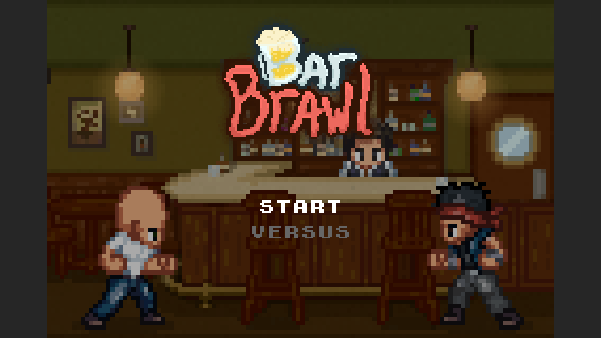

# Bar Brawl — offline mirror

Full mirror of **Bar Brawl** by digow (itch.io): a 1-v-1 pixel-art bar-fight
game — punch/kick/crouch fighters in a bar stage, frame-accurate SFX, menu
flow, and online multiplayer over WebRTC with Supabase realtime signaling.

Embed: https://html-classic.itch.zone/html/19181675/ (game ID 19181675)

Source: https://digow.itch.io/bar-brawl



## Stack

What the mirror is built with, read from the files themselves:

- **Supabase backend** — `game/game.min.js`
- **canvas 2D** — `game/game.min.js`
- **Web Audio API** — `game/game.min.js`

Assets in the mirror: 30 audio, 8 images, 2 data files.

## What this is

The deployment lives in the repo root, mirrored byte-for-byte — page, scripts, styles and the assets the site actually serves. The site's own bundles are here too: `game/game.min.js` (57 KB), `src/01-fighter.js` (39 KB), `src/06-game-render.js` (30 KB), `src/04-menu.js` (9 KB). `readable/` carries the readable layer (1 file), 1 prettified bundle (2,692 lines); `split-spec.json` indexes 7 entries, each naming the file it came from.

## Layout

- `index.html`, `style.css`, `main.js`, `game/`, `assets/` — served files, byte-exact
  - `main.js` is the author's own hand-written boot file (FighterEngine + 60 Hz Worker tick loop)
  - `game/worker.js` is the author's own tick worker
- `assets/` — 7 sprite/stage sheets + 30 `.ogg` sounds (punches, groans, rounds, music)
- `readable/game.pretty.js` — prettified view of `game/game.min.js` (2,691 lines)
- `src/` — 7 class-based slices cut from the spec:

| Slice | Contents |
|---|---|
| `00-primitives` | circle & rotated-rect collision primitives |
| `01-fighter` | Fighter: sprite animations, per-move cooldowns, hit boxes |
| `02-engine` | FighterEngine core: Begin/Reset, round management |
| `03-input` | keyboard mapping + input-sequence history (netcode recovery) |
| `04-menu` | intro/logo/menu screens, pixel-text UI |
| `05-multiplayer` | WebRTC + Supabase signaling (live-only; offline reports no connection) |
| `06-game-render` | match renderer, frame-accurate SFX director, camera, win/lose flow |

Also present at top level: `.upstream/`, `docs/`, `tools/`, `README.md`, `rename-map.json`, `split-spec.json`.

## Run

```bash
npx http-server . -p 4306   # serves index.html
```

## Verify

```bash
node tools/update.mjs               # compare the mirror against the live origin
```

This project's own tooling: `tools/split.mjs`, `tools/verify.mjs`.

## Updating from upstream

```
node tools/update.mjs          # probe the itch embed version param; --pull refreshes
node tools/split.mjs           # re-cut src/ from the spec
node tools/verify.mjs          # byte-exact check
```

itch embeds are versioned by the `?v=` query parameter on the game page — the
probe compares the game page's embed URL and the engine hash, so a no-change
check is two small requests.

## Multiplayer note

The netcode connects to the author's Supabase signaling endpoint
(publishable key embedded in the source). Offline, single-player mode plays
fully; online mode reports no connection.

## Mirror conventions

- **Capture layer** — the files under the deployment directory are byte-exact copies of what the origin served; nothing in them is edited.
- **Readable layer** — derived, on top of the capture: prettified bundles and reconstructed modules. Vendor libraries ship whole and are listed in `dependencies.json`; they are never split.
- **Provenance** — `split-spec.json` maps every readable file back to the bundle (and byte range) it came from; `.upstream/manifest.json` records sha256 for each mirrored artifact.
- **Drift** — `tools/update.mjs` is a read-only probe: it reports what changed upstream and never rewrites the capture. Refreshing regenerates the readable layer on top of a newly pulled build.
- **Standalone** — the tooling engine is vendored in `tools/engine/`, so this repo works from a fresh clone with no sibling checkout.
